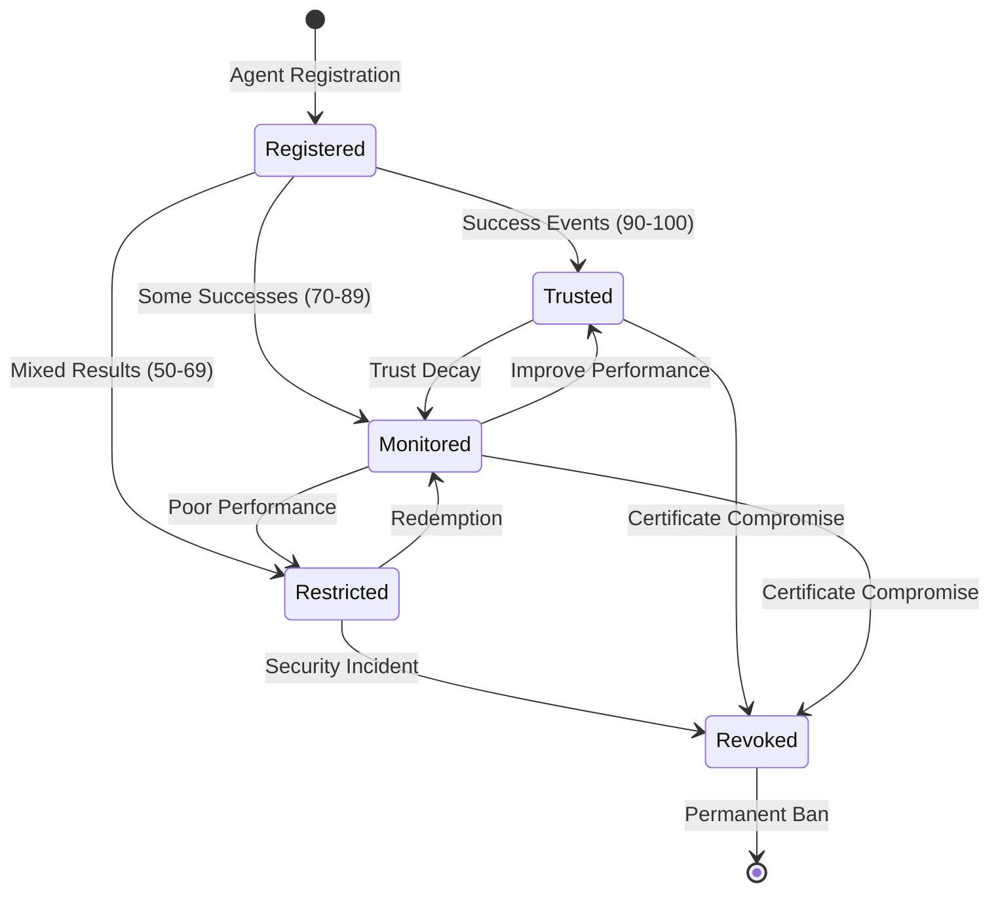
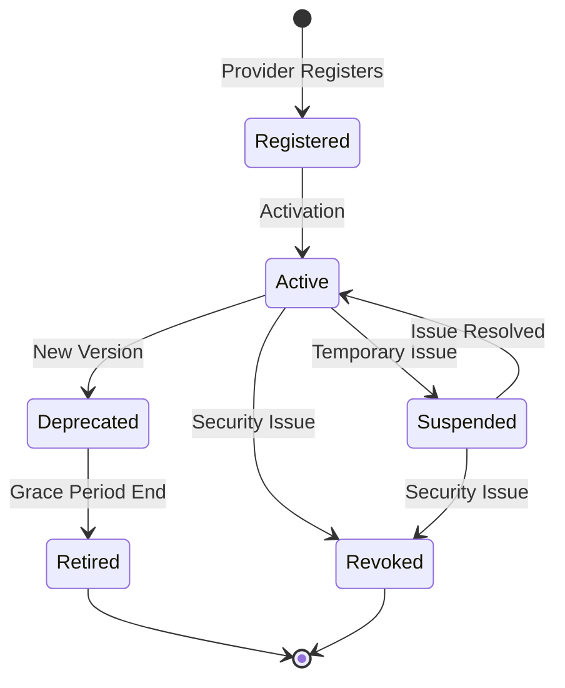
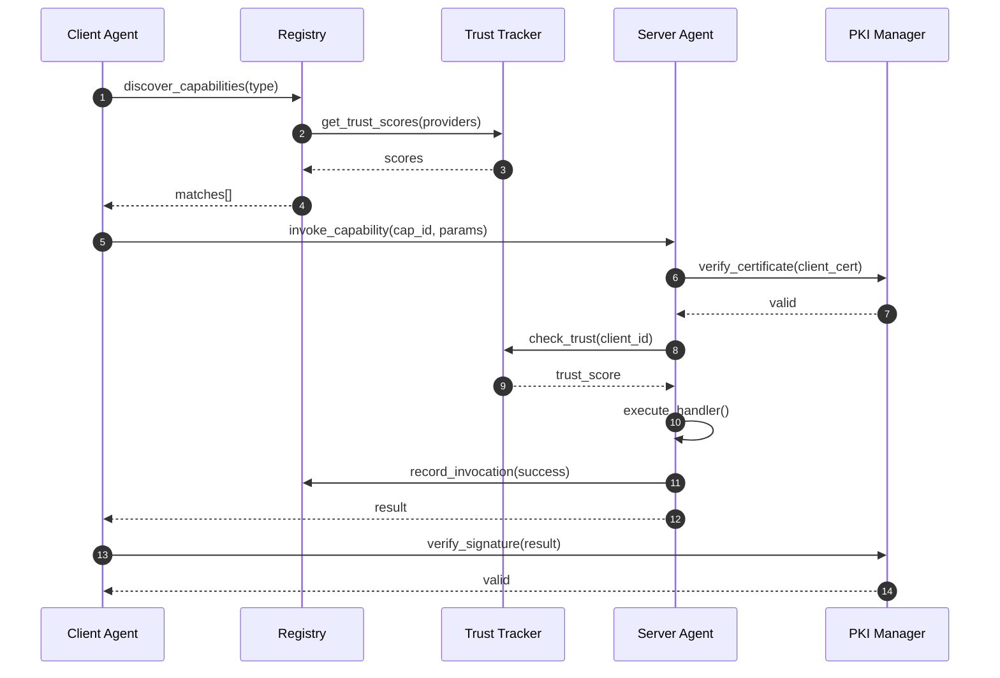
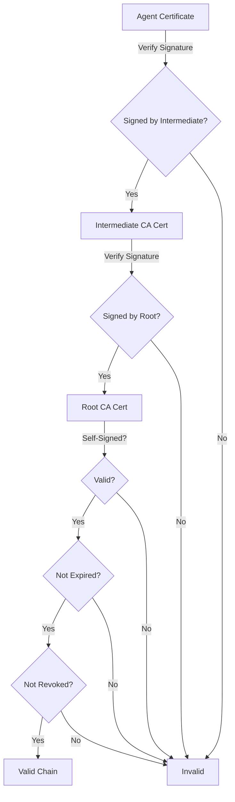
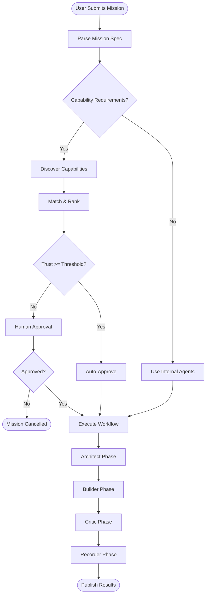
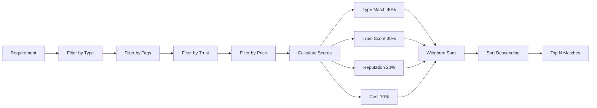

# Next Documentation Tasks

Optional enhancements to take the documentation to the next level.

**Status**: Ready to start after PR #30 is merged
**Priority**: Optional (documentation is production-ready as-is)
**Estimated Total Time**: 2-3 weeks

---

## Task 1: Generate HTML Documentation with Sphinx

### Overview
Create professional HTML documentation using Sphinx, the standard documentation generator for Python projects.

### Benefits
- Professional, searchable HTML documentation
- Automatic API documentation from docstrings
- Version-based documentation hosting
- Built-in search functionality
- Multiple output formats (HTML, PDF, ePub)

### Implementation Plan

#### Step 1: Setup Sphinx (1-2 hours)

```bash
# Install Sphinx and extensions
pip install sphinx sphinx-rtd-theme sphinx-autodoc-typehints

# Initialize Sphinx
cd docs/
sphinx-quickstart

# Configuration:
# - Separate source and build: Yes
# - Project name: Team Agent
# - Author: Team Agent Development Team
# - Version: 0.4.0
# - Language: en
```

#### Step 2: Configure Sphinx (2-3 hours)

Create `docs/source/conf.py`:

```python
import os
import sys
sys.path.insert(0, os.path.abspath('../../'))

project = 'Team Agent'
copyright = '2025, Team Agent Development Team'
author = 'Team Agent Development Team'
version = '0.4.0'
release = '0.4.0'

# Extensions
extensions = [
    'sphinx.ext.autodoc',           # Auto-generate from docstrings
    'sphinx.ext.napoleon',          # Google-style docstrings
    'sphinx.ext.viewcode',          # Source code links
    'sphinx.ext.intersphinx',       # Link to other docs
    'sphinx.ext.autosummary',       # Generate summary tables
    'sphinx_rtd_theme',             # ReadTheDocs theme
    'sphinx_autodoc_typehints',     # Type hints support
    'myst_parser',                  # Markdown support
]

# Theme
html_theme = 'sphinx_rtd_theme'
html_theme_options = {
    'navigation_depth': 4,
    'collapse_navigation': False,
    'sticky_navigation': True,
}

# Autodoc settings
autodoc_default_options = {
    'members': True,
    'member-order': 'bysource',
    'special-members': '__init__',
    'undoc-members': True,
    'exclude-members': '__weakref__'
}

# Markdown support
source_suffix = {
    '.rst': 'restructuredtext',
    '.md': 'markdown',
}
```

#### Step 3: Create Documentation Structure (3-4 hours)

Create `docs/source/index.rst`:

```rst
Team Agent Documentation
========================

.. toctree::
   :maxdepth: 2
   :caption: Getting Started

   getting-started/installation
   getting-started/quick-start
   getting-started/examples

.. toctree::
   :maxdepth: 2
   :caption: Architecture

   architecture/overview
   architecture/diagrams
   architecture/a2a

.. toctree::
   :maxdepth: 2
   :caption: API Reference

   api/index
   api/orchestrator
   api/registry
   api/protocol
   api/pki
   api/trust

.. toctree::
   :maxdepth: 2
   :caption: Features

   features/pki-control-plane
   features/a2a-system
   features/smart-contracts

.. toctree::
   :maxdepth: 2
   :caption: Development

   development/setup
   development/testing
   development/contributing
```

#### Step 4: Auto-Generate API Docs (2-3 hours)

Create `docs/source/api/modules.rst`:

```rst
API Reference
=============

.. autosummary::
   :toctree: _autosummary
   :recursive:

   swarms.team_agent.orchestrator
   swarms.team_agent.orchestrator_a2a
   swarms.team_agent.a2a.registry
   swarms.team_agent.a2a.protocol
   swarms.team_agent.crypto.pki
   swarms.team_agent.crypto.signing
   swarms.team_agent.crypto.trust
```

#### Step 5: Build and Test (1 hour)

```bash
# Build HTML docs
cd docs/
make html

# View locally
open build/html/index.html

# Build PDF (optional)
make latexpdf
```

#### Step 6: Setup GitHub Actions (2 hours)

Create `.github/workflows/docs.yml`:

```yaml
name: Documentation

on:
  push:
    branches: [main]
  pull_request:
    branches: [main]

jobs:
  build-docs:
    runs-on: ubuntu-latest
    steps:
      - uses: actions/checkout@v3
      - uses: actions/setup-python@v4
        with:
          python-version: '3.11'

      - name: Install dependencies
        run: |
          pip install sphinx sphinx-rtd-theme sphinx-autodoc-typehints myst-parser
          pip install -r requirements.txt

      - name: Build docs
        run: |
          cd docs
          make html

      - name: Deploy to GitHub Pages
        if: github.ref == 'refs/heads/main'
        uses: peaceiris/actions-gh-pages@v3
        with:
          github_token: ${{ secrets.GITHUB_TOKEN }}
          publish_dir: ./docs/build/html
```

### Deliverables
- [ ] Sphinx configuration
- [ ] HTML documentation site
- [ ] Auto-generated API reference
- [ ] GitHub Pages deployment
- [ ] PDF documentation (optional)

**Estimated Time**: 10-15 hours

---

## Task 2: Add More Mermaid Diagrams

### Overview
Enhance existing documentation with interactive Mermaid diagrams.

### Benefits
- Interactive, zoomable diagrams
- Renders in GitHub, GitLab, VS Code
- Version-controlled (text-based)
- Easy to update and maintain

### Implementation Plan

#### Diagrams to Add

**1. Trust Score State Machine (1 hour)**

Add to `docs/architecture/diagrams.md`:



**2. Capability Lifecycle (1 hour)**



**3. Message Flow Diagram (2 hours)**



**4. PKI Certificate Chain Validation (1.5 hours)**



**5. Workflow Orchestration Flow (2 hours)**



**6. Registry Matching Algorithm (1.5 hours)**



### Deliverables
- [ ] Trust score state machine
- [ ] Capability lifecycle diagram
- [ ] Enhanced message flow
- [ ] Certificate validation flow
- [ ] Workflow orchestration flowchart
- [ ] Registry matching algorithm

**Estimated Time**: 9 hours

---

## Task 3: Create Video Tutorials

### Overview
Create screencast tutorials demonstrating key features.

### Benefits
- Visual learning for complex concepts
- Shareable on YouTube, social media
- Reduces support burden
- Onboards new users faster

### Implementation Plan

#### Tutorial 1: Quick Start (15 minutes)
- Installation walkthrough
- First mission execution
- Viewing results
- **Script**: Based on quick-start.md
- **Tools**: OBS Studio, Camtasia, or ScreenFlow

#### Tutorial 2: PKI Setup (20 minutes)
- PKI initialization
- Certificate generation
- Signing and verification
- Revocation workflow
- **Script**: Based on PKI examples

#### Tutorial 3: A2A Capabilities (25 minutes)
- Provider registration
- Capability publishing
- Discovery and matching
- Mission execution with A2A
- **Script**: Based on A2A examples

#### Tutorial 4: Development Setup (20 minutes)
- Development environment
- Running tests
- Creating a capability
- Debugging
- **Script**: Based on development/setup.md

#### Production Steps

**Pre-Production (4 hours)**
- Write detailed scripts
- Create demo environment
- Prepare example data
- Test run-throughs

**Recording (8 hours)**
- Record each tutorial (2 hours each)
- Record voiceover
- Capture screen at 1080p

**Post-Production (8 hours)**
- Edit videos (2 hours each)
- Add titles and annotations
- Add background music
- Export and upload

**Publishing (2 hours)**
- Upload to YouTube
- Create thumbnails
- Write descriptions
- Add to documentation

### Deliverables
- [ ] Tutorial 1: Quick Start (15 min)
- [ ] Tutorial 2: PKI Setup (20 min)
- [ ] Tutorial 3: A2A Capabilities (25 min)
- [ ] Tutorial 4: Development (20 min)
- [ ] YouTube channel setup
- [ ] Video links in documentation

**Estimated Time**: 22 hours

---

## Task 4: Setup Documentation Hosting

### Overview
Deploy documentation to a professional hosting platform.

### Options

#### Option A: GitHub Pages (Recommended)
**Pros**: Free, automatic deployment, custom domain
**Cons**: Public only

**Setup** (2 hours):
```bash
# Already configured in Task 1 GitHub Actions
# Just enable in repository settings
```

#### Option B: ReadTheDocs
**Pros**: Free for open source, versioned docs, search
**Cons**: Requires RTD account

**Setup** (3 hours):
1. Create account at readthedocs.org
2. Import GitHub repository
3. Configure `.readthedocs.yml`:

```yaml
version: 2

build:
  os: ubuntu-22.04
  tools:
    python: "3.11"

sphinx:
  configuration: docs/source/conf.py

python:
  install:
    - requirements: requirements.txt
    - method: pip
      path: .
```

4. Configure webhook for auto-builds
5. Set up custom domain (optional)

#### Option C: Docusaurus (Modern Alternative)
**Pros**: React-based, modern UI, Algolia search
**Cons**: More setup, requires Node.js

**Setup** (6-8 hours):
1. Install Docusaurus
2. Migrate Markdown files
3. Configure navigation
4. Deploy to Netlify/Vercel

### Recommended: GitHub Pages + ReadTheDocs

Use both for redundancy and features:
- **GitHub Pages**: Latest main branch
- **ReadTheDocs**: Versioned documentation (v0.3, v0.4, etc.)

### Deliverables
- [ ] GitHub Pages deployment
- [ ] ReadTheDocs setup (optional)
- [ ] Custom domain configuration (optional)
- [ ] SSL certificate
- [ ] Automatic deployment pipeline

**Estimated Time**: 3-5 hours

---

## Task 5: Add Interactive Examples with Jupyter Notebooks

### Overview
Create interactive Jupyter notebooks for hands-on learning.

### Benefits
- Interactive code execution
- Immediate feedback
- Great for tutorials
- Can run in browser (Binder, Colab)

### Implementation Plan

#### Notebook 1: Quick Start Tour (2 hours)

`examples/notebooks/01-quick-start.ipynb`:

```python
# Quick Start with Team Agent

## Installation
# Run this cell to install Team Agent
!pip install -r requirements.txt

## Initialize Systems
from swarms.team_agent.crypto import PKIManager, AgentReputationTracker
from swarms.team_agent.a2a import CapabilityRegistry

pki = PKIManager()
pki.initialize_pki()

trust_tracker = AgentReputationTracker()
registry = CapabilityRegistry(trust_tracker=trust_tracker, pki_manager=pki)

print("✅ Systems initialized!")

## Your First Mission
from swarms.team_agent.orchestrator import Orchestrator

orchestrator = Orchestrator()
result = orchestrator.execute("Create a simple calculator")

print(f"Mission completed! Output: {result['output_dir']}")

# ... more interactive cells
```

#### Notebook 2: PKI Deep Dive (3 hours)

`examples/notebooks/02-pki-deep-dive.ipynb`:
- Certificate generation
- Signing examples
- Revocation workflow
- Trust scoring visualization

#### Notebook 3: A2A Capabilities (3 hours)

`examples/notebooks/03-a2a-capabilities.ipynb`:
- Provider registration
- Capability matching
- Interactive mission execution
- Visualization of matching scores

#### Notebook 4: Trust Scoring Analysis (2 hours)

`examples/notebooks/04-trust-analysis.ipynb`:
- Trust score calculation
- Event simulation
- Score visualization with matplotlib
- Trust decay over time

#### Setup Interactive Hosting (2 hours)

**Option A: Binder** (Free)
```yaml
# binder/environment.yml
name: team-agent
dependencies:
  - python=3.11
  - pip
  - pip:
    - -r ../requirements.txt
```

Add badge to README:
```markdown
[](https://mybinder.org/v2/gh/lalbacore/ta_base/main?filepath=examples%2Fnotebooks)
```

**Option B: Google Colab** (Free)
Add "Open in Colab" badges to each notebook.

### Deliverables
- [ ] 4 interactive Jupyter notebooks
- [ ] Binder configuration
- [ ] Google Colab links
- [ ] Visualization examples
- [ ] Badge in README

**Estimated Time**: 12 hours

---

## Summary Timeline

| Task | Priority | Time | Dependencies |
|------|----------|------|--------------|
| 1. Sphinx HTML Docs | High | 10-15h | None |
| 2. Mermaid Diagrams | Medium | 9h | None |
| 3. Video Tutorials | Medium | 22h | None |
| 4. Doc Hosting | High | 3-5h | Task 1 |
| 5. Jupyter Notebooks | Low | 12h | None |

**Total Estimated Time**: 56-63 hours (2-3 weeks)

---

## Recommended Order

1. **Week 1**: Task 1 (Sphinx) + Task 4 (Hosting) → Professional docs site
2. **Week 2**: Task 2 (Diagrams) → Enhanced visual documentation
3. **Week 3**: Task 3 (Videos) OR Task 5 (Notebooks) → Interactive learning

---

## Success Metrics

- [ ] Documentation site accessible at custom domain
- [ ] API documentation auto-generated from code
- [ ] All diagrams render correctly in GitHub
- [ ] At least 2 video tutorials published
- [ ] Interactive notebooks runnable in browser
- [ ] Search functionality working
- [ ] Mobile-responsive documentation
- [ ] Page load time < 2 seconds

---

## Resources Needed

**Software:**
- Python 3.11+
- Sphinx and extensions
- OBS Studio or screen recorder
- Video editing software
- Jupyter Notebook

**Services:**
- GitHub account (existing)
- ReadTheDocs account (free)
- YouTube account (for videos)
- Binder account (free)

**Optional:**
- Custom domain ($12/year)
- Professional video editing software
- Algolia search (free for open source)

---

**Ready to start?** Pick a task and dive in! Each can be done independently.
