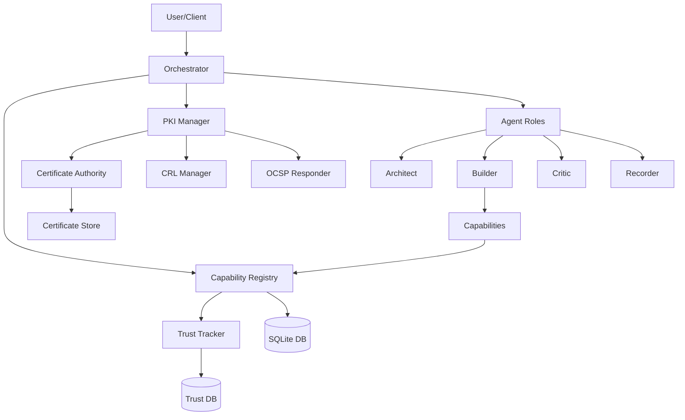
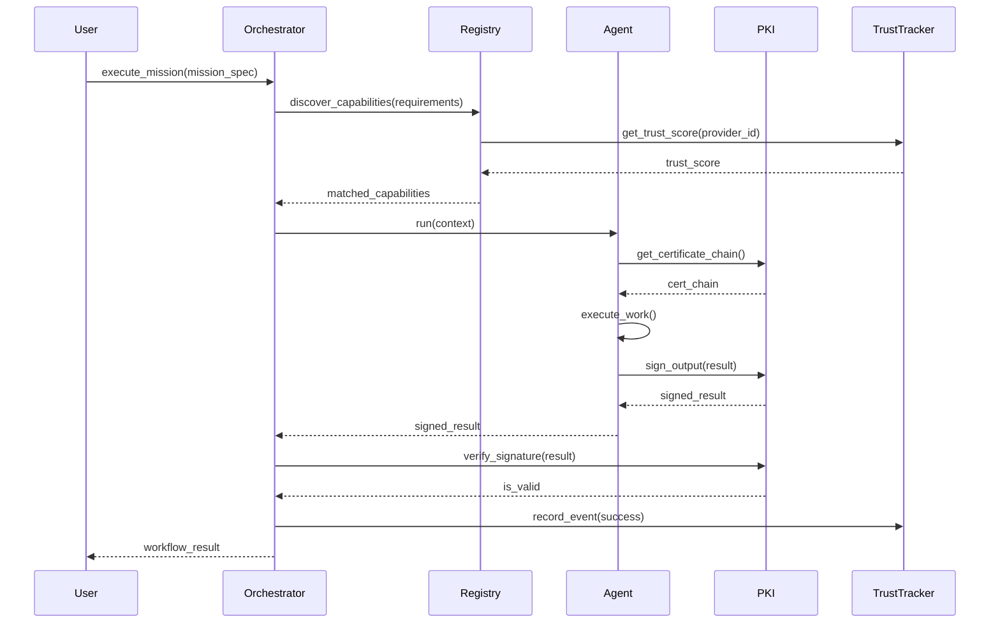
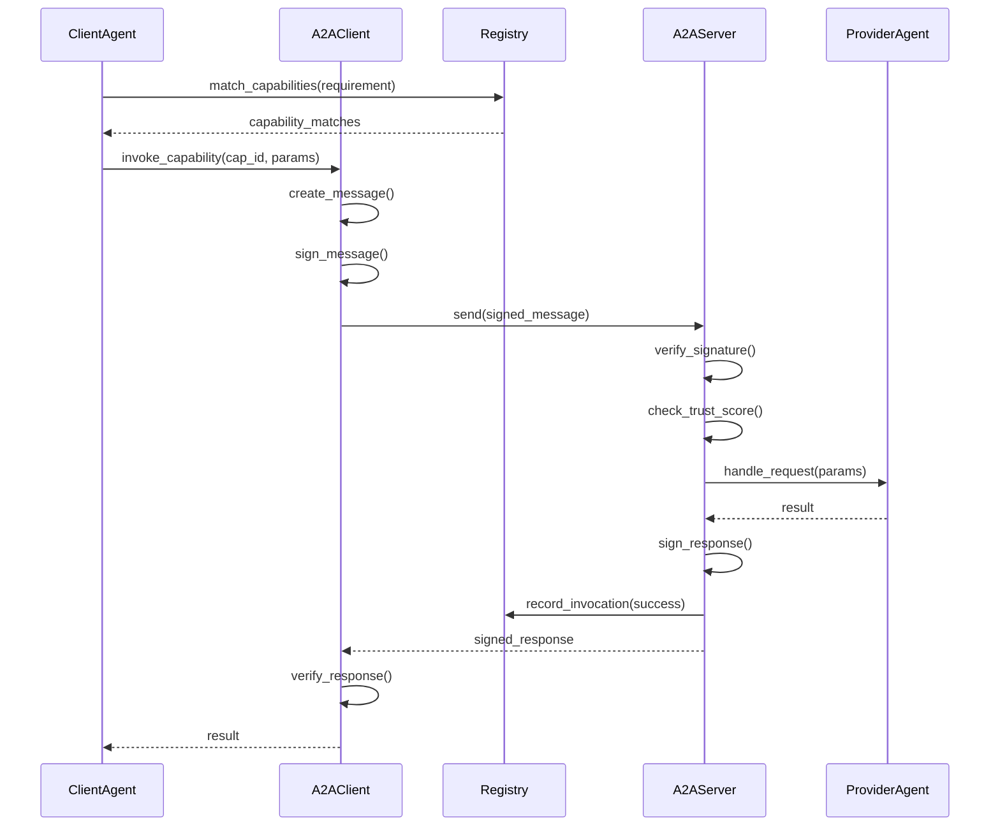

# Architecture Diagrams

Visual representations of Team Agent system architecture.

---

## Table of Contents

- [System Overview](#system-overview)
- [Component Architecture](#component-architecture)
- [Workflow Sequence](#workflow-sequence)
- [PKI Infrastructure](#pki-infrastructure)
- [A2A Communication](#a2a-communication)
- [Trust Scoring](#trust-scoring)
- [Data Flow](#data-flow)

---

## System Overview

### High-Level Architecture

```
┌─────────────────────────────────────────────────────────────────┐
│                      Team Agent System                           │
└─────────────────────────────────────────────────────────────────┘
                               │
        ┌──────────────────────┼──────────────────────┐
        │                      │                      │
        ▼                      ▼                      ▼
┌───────────────┐      ┌───────────────┐     ┌───────────────┐
│ Orchestration │      │   Security    │     │   Discovery   │
│    Layer      │      │     Layer     │     │     Layer     │
│               │      │               │     │               │
│ • Orchestrator│      │ • PKI Manager │     │ • Registry    │
│ • Missions    │      │ • Signer      │     │ • A2A Protocol│
│ • Workflows   │      │ • Verifier    │     │ • Matching    │
└───────┬───────┘      └───────┬───────┘     └───────┬───────┘
        │                      │                      │
        └──────────────────────┼──────────────────────┘
                               │
                               ▼
                    ┌────────────────────┐
                    │   Storage Layer    │
                    │                    │
                    │ • SQLite DBs       │
                    │ • File System      │
                    │ • Certificates     │
                    └────────────────────┘
```

### Component Interaction Map



---

## Component Architecture

### Orchestrator Architecture

```
┌─────────────────────────────────────────────────────────────┐
│                   OrchestratorA2A                            │
├─────────────────────────────────────────────────────────────┤
│                                                             │
│  ┌────────────────┐      ┌────────────────┐               │
│  │ Mission Parser │      │ Context        │               │
│  │                │──────▶│ Preparation    │               │
│  └────────────────┘      └────────────────┘               │
│           │                      │                         │
│           ▼                      ▼                         │
│  ┌────────────────┐      ┌────────────────┐               │
│  │ Capability     │      │ Agent          │               │
│  │ Discovery      │◀─────│ Execution      │               │
│  └────────────────┘      └────────────────┘               │
│           │                      │                         │
│           ▼                      ▼                         │
│  ┌────────────────┐      ┌────────────────┐               │
│  │ Capability     │      │ Artifact       │               │
│  │ Matching       │      │ Publishing     │               │
│  └────────────────┘      └────────────────┘               │
│                                                             │
└─────────────────────────────────────────────────────────────┘
```

### Capability Registry Architecture

```
┌──────────────────────────────────────────────────────────────┐
│                    Capability Registry                        │
├──────────────────────────────────────────────────────────────┤
│                                                              │
│  ┌──────────────┐   ┌──────────────┐   ┌──────────────┐   │
│  │  Provider    │   │  Capability  │   │  Invocation  │   │
│  │  Management  │   │  Management  │   │  Tracking    │   │
│  └──────┬───────┘   └──────┬───────┘   └──────┬───────┘   │
│         │                  │                   │            │
│         └──────────────────┼───────────────────┘            │
│                            │                                │
│                    ┌───────▼────────┐                       │
│                    │  SQLite DB     │                       │
│                    │                │                       │
│                    │ • providers    │                       │
│                    │ • capabilities │                       │
│                    │ • invocations  │                       │
│                    └────────────────┘                       │
│                                                              │
│  ┌──────────────────────────────────────────────────────┐  │
│  │            Matching Engine                           │  │
│  │  • Type matching (40%)                               │  │
│  │  • Trust scoring (30%)                               │  │
│  │  • Reputation (20%)                                  │  │
│  │  • Cost optimization (10%)                           │  │
│  └──────────────────────────────────────────────────────┘  │
│                                                              │
└──────────────────────────────────────────────────────────────┘
```

---

## Workflow Sequence

### Mission Execution Sequence



### Capability Invocation Sequence



---

## PKI Infrastructure

### Certificate Authority Hierarchy

```
                    ┌────────────────────────┐
                    │      Root CA           │
                    │  (Self-signed)         │
                    │  Validity: 10 years    │
                    │  Key: RSA-4096         │
                    └───────────┬────────────┘
                                │
                ┌───────────────┼───────────────┐
                │               │               │
        ┌───────▼──────┐ ┌─────▼──────┐ ┌─────▼──────┐
        │ Government   │ │ Execution  │ │  Logging   │
        │     CA       │ │     CA     │ │     CA     │
        │ RSA-4096     │ │ RSA-4096   │ │ RSA-4096   │
        │ 5 years      │ │ 5 years    │ │ 5 years    │
        └──────┬───────┘ └─────┬──────┘ └─────┬──────┘
               │               │               │
        ┌──────▼──────┐ ┌──────▼──────┐ ┌─────▼──────┐
        │ Governance  │ │ Architect   │ │  Recorder  │
        │   Agent     │ │   Agent     │ │   Agent    │
        │             │ │ Builder     │ │            │
        │             │ │ Critic      │ │            │
        └─────────────┘ └─────────────┘ └────────────┘
```

### Trust Scoring System

```
┌─────────────────────────────────────────────────────────────┐
│               Agent Reputation Tracker                       │
├─────────────────────────────────────────────────────────────┤
│                                                             │
│  Event Recording:                                           │
│  ┌────────────┐   ┌────────────┐   ┌────────────┐         │
│  │  Success   │   │  Failure   │   │  Security  │         │
│  │   +1.0     │   │   -2.0     │   │  Incident  │         │
│  │            │   │            │   │   -5.0     │         │
│  └─────┬──────┘   └─────┬──────┘   └─────┬──────┘         │
│        │                │                │                 │
│        └────────────────┼────────────────┘                 │
│                         │                                  │
│                   ┌─────▼──────┐                           │
│                   │   Trust    │                           │
│                   │   Score    │                           │
│                   │ Calculator │                           │
│                   └─────┬──────┘                           │
│                         │                                  │
│         ┌───────────────┼───────────────┐                 │
│         │               │               │                 │
│   ┌─────▼─────┐   ┌────▼────┐   ┌──────▼──────┐          │
│   │ TRUSTED   │   │MONITORED│   │ RESTRICTED  │          │
│   │ 90-100    │   │ 70-89   │   │  50-69      │          │
│   └───────────┘   └─────────┘   └─────────────┘          │
│                                                             │
│  Decay: -0.1 per day of inactivity                        │
│  Boost: +0.5 per successful operation                     │
│  Penalty: -5.0 per security incident                      │
│                                                             │
└─────────────────────────────────────────────────────────────┘
```

---

## A2A Communication

### Message Flow

```
┌──────────────┐                              ┌──────────────┐
│   Client     │                              │   Server     │
│   Agent      │                              │   Agent      │
└──────┬───────┘                              └──────┬───────┘
       │                                             │
       │  1. Create Message                          │
       │  ┌────────────────────────┐                 │
       │  │ MessageType: REQUEST   │                 │
       │  │ Sender: client-id      │                 │
       │  │ Recipient: server-id   │                 │
       │  │ Payload: {...}         │                 │
       │  │ Correlation: uuid      │                 │
       │  └────────────────────────┘                 │
       │                                             │
       │  2. Sign Message (RSA-4096)                 │
       │  ┌────────────────────────┐                 │
       │  │ ...message...          │                 │
       │  │ _signature: {          │                 │
       │  │   data: "base64..."    │                 │
       │  │   cert: "pem..."       │                 │
       │  │ }                      │                 │
       │  └────────────────────────┘                 │
       │                                             │
       │  3. Send ──────────────────────────────────▶│
       │                                             │
       │                              4. Verify      │
       │                              Signature      │
       │                                             │
       │                              5. Check       │
       │                              Trust Score    │
       │                                             │
       │                              6. Execute     │
       │                              Handler        │
       │                                             │
       │  7. Response ◀──────────────────────────────│
       │  (Signed)                                   │
       │                                             │
       │  8. Verify Response                         │
       │                                             │
       ▼                                             ▼
```

### Capability Matching Algorithm

```
┌─────────────────────────────────────────────────────────────┐
│              Capability Matching Process                     │
├─────────────────────────────────────────────────────────────┤
│                                                             │
│  Input: CapabilityRequirement                              │
│  ┌──────────────────────────────────────────┐              │
│  │ • type: CODE_GENERATION                  │              │
│  │ • required_tags: ["python"]              │              │
│  │ • min_trust_score: 80.0                  │              │
│  │ • max_price: 15.0                        │              │
│  └──────────────────────────────────────────┘              │
│                      │                                      │
│                      ▼                                      │
│  ┌──────────────────────────────────────────┐              │
│  │  Step 1: Type Filter                     │              │
│  │  Filter WHERE type = CODE_GENERATION     │              │
│  └─────────────────┬────────────────────────┘              │
│                    │                                        │
│                    ▼                                        │
│  ┌──────────────────────────────────────────┐              │
│  │  Step 2: Tag Filter                      │              │
│  │  Filter WHERE tags INCLUDE "python"      │              │
│  └─────────────────┬────────────────────────┘              │
│                    │                                        │
│                    ▼                                        │
│  ┌──────────────────────────────────────────┐              │
│  │  Step 3: Trust Filter                    │              │
│  │  Filter WHERE trust >= 80.0              │              │
│  └─────────────────┬────────────────────────┘              │
│                    │                                        │
│                    ▼                                        │
│  ┌──────────────────────────────────────────┐              │
│  │  Step 4: Price Filter                    │              │
│  │  Filter WHERE price <= 15.0              │              │
│  └─────────────────┬────────────────────────┘              │
│                    │                                        │
│                    ▼                                        │
│  ┌──────────────────────────────────────────┐              │
│  │  Step 5: Score Calculation               │              │
│  │                                          │              │
│  │  score = (                               │              │
│  │    type_match    * 0.40 +  [40 pts]     │              │
│  │    trust_score   * 0.30 +  [30 pts]     │              │
│  │    reputation    * 0.20 +  [20 pts]     │              │
│  │    cost_score    * 0.10    [10 pts]     │              │
│  │  )                                       │              │
│  └─────────────────┬────────────────────────┘              │
│                    │                                        │
│                    ▼                                        │
│  ┌──────────────────────────────────────────┐              │
│  │  Step 6: Sort by Score                   │              │
│  │  ORDER BY overall_score DESC             │              │
│  │  LIMIT 10                                │              │
│  └─────────────────┬────────────────────────┘              │
│                    │                                        │
│                    ▼                                        │
│  Output: Ranked CapabilityMatch[]                          │
│  ┌──────────────────────────────────────────┐              │
│  │ [0] score: 95.5 - "Expert Python Gen"   │              │
│  │ [1] score: 92.3 - "Pro Python Builder"  │              │
│  │ [2] score: 88.7 - "Code Generator X"    │              │
│  │ ...                                      │              │
│  └──────────────────────────────────────────┘              │
│                                                             │
└─────────────────────────────────────────────────────────────┘
```

---

## Data Flow

### Workflow Data Flow

```
┌─────────┐
│ Mission │
└────┬────┘
     │
     ▼
┌────────────────────┐
│ 1. ARCHITECTURE    │
│                    │
│ ┌────────────────┐ │     ┌──────────────┐
│ │   Architect    │─┼────▶│ architecture │
│ │                │ │     │    .json     │
│ └────────────────┘ │     └──────────────┘
└────────┬───────────┘
         │
         ▼
┌────────────────────┐
│ 2. IMPLEMENTATION  │
│                    │
│ ┌────────────────┐ │     ┌──────────────┐
│ │ Dynamic Builder│─┼────▶│ artifacts[]  │
│ │   ┌──────────┐ │ │     │  - .py files │
│ │   │Registry  │ │ │     │  - .md docs  │
│ │   │Capability│ │ │     │  - etc.      │
│ │   └──────────┘ │ │     └──────────────┘
│ └────────────────┘ │
└────────┬───────────┘
         │
         ▼
┌────────────────────┐
│ 3. REVIEW          │
│                    │
│ ┌────────────────┐ │     ┌──────────────┐
│ │    Critic      │─┼────▶│ review.json  │
│ │                │ │     │  - issues[]  │
│ └────────────────┘ │     │  - score     │
└────────┬───────────┘     └──────────────┘
         │
         ▼
┌────────────────────┐
│ 4. RECORDING       │
│                    │
│ ┌────────────────┐ │     ┌──────────────┐
│ │   Recorder     │─┼────▶│ Published    │
│ │                │ │     │   Artifacts  │
│ └────────────────┘ │     │   + Record   │
└────────────────────┘     └──────────────┘
```

### Trust Score Calculation Flow

```
Event ────▶ AgentReputationTracker
              │
              ▼
         ┌─────────────────────┐
         │  Record in DB       │
         │  • event_type       │
         │  • timestamp        │
         │  • metadata         │
         └──────────┬──────────┘
                    │
                    ▼
         ┌─────────────────────┐
         │  Update Counters    │
         │  • total_ops++      │
         │  • successes++      │
         │  • failures++       │
         └──────────┬──────────┘
                    │
                    ▼
         ┌─────────────────────┐
         │  Calculate Score    │
         │                     │
         │  base = 100.0       │
         │  success_bonus      │
         │    = rate * 50      │
         │  failure_penalty    │
         │    = fails * -2     │
         │  incident_penalty   │
         │    = incidents * -5 │
         │                     │
         │  trust_score =      │
         │    base +           │
         │    success_bonus +  │
         │    failure_penalty +│
         │    incident_penalty │
         │                     │
         │  clamp(0, 100)      │
         └──────────┬──────────┘
                    │
                    ▼
         ┌─────────────────────┐
         │  Store Score        │
         │  • agent_id         │
         │  • trust_score      │
         │  • updated_at       │
         └─────────────────────┘
```

---

## Deployment Architecture

### Single-Node Deployment

```
┌────────────────────────────────────────────────────────┐
│                   Host Machine                         │
├────────────────────────────────────────────────────────┤
│                                                        │
│  ┌──────────────────────────────────────────────┐    │
│  │        Team Agent Process                     │    │
│  │                                               │    │
│  │  • Orchestrator                               │    │
│  │  • Agents (Architect, Builder, Critic, etc.)  │    │
│  │  • PKI Manager                                │    │
│  │  • Trust Tracker                              │    │
│  │  • Capability Registry                        │    │
│  └──────────────────┬───────────────────────────┘    │
│                     │                                 │
│  ┌──────────────────▼───────────────────────────┐    │
│  │          File System Storage                  │    │
│  │                                               │    │
│  │  ~/.team_agent/                               │    │
│  │  ├── pki/           (Certificates)            │    │
│  │  ├── trust.db       (Trust scores)            │    │
│  │  ├── registry.db    (Capabilities)            │    │
│  │  └── secrets/       (Encrypted secrets)       │    │
│  └───────────────────────────────────────────────┘    │
│                                                        │
└────────────────────────────────────────────────────────┘
```

### Distributed Deployment (Future)

```
┌──────────────┐    ┌──────────────┐    ┌──────────────┐
│   Node 1     │    │   Node 2     │    │   Node 3     │
│              │    │              │    │              │
│ Orchestrator │◀──▶│  Architect   │◀──▶│   Builder    │
│   Registry   │    │   Agent      │    │   Agent      │
│   PKI Mgr    │    │              │    │              │
└──────┬───────┘    └──────┬───────┘    └──────┬───────┘
       │                   │                   │
       └───────────────────┼───────────────────┘
                           │
                           ▼
                  ┌─────────────────┐
                  │  Shared Storage │
                  │  • PostgreSQL   │
                  │  • Distributed  │
                  │    Certificate  │
                  │    Store        │
                  └─────────────────┘
```

---

## Security Architecture

### Defense in Depth

```
┌─────────────────────────────────────────────────────────────┐
│                    Security Layers                           │
├─────────────────────────────────────────────────────────────┤
│                                                             │
│  Layer 1: PKI & Certificates                                │
│  ┌────────────────────────────────────────────────────┐    │
│  │ • RSA-4096 signatures                              │    │
│  │ • Certificate chain validation                     │    │
│  │ • CRL & OCSP revocation checking                   │    │
│  └────────────────────────────────────────────────────┘    │
│                                                             │
│  Layer 2: Trust Scoring                                     │
│  ┌────────────────────────────────────────────────────┐    │
│  │ • Behavioral reputation tracking                   │    │
│  │ • Real-time trust score calculation                │    │
│  │ • Automatic thresholds and restrictions            │    │
│  └────────────────────────────────────────────────────┘    │
│                                                             │
│  Layer 3: Access Control                                    │
│  ┌────────────────────────────────────────────────────┐    │
│  │ • Trust-based authorization                        │    │
│  │ • Capability-level permissions                     │    │
│  │ • Domain separation (Government/Execution/Log)     │    │
│  └────────────────────────────────────────────────────┘    │
│                                                             │
│  Layer 4: Secrets Management                                │
│  ┌────────────────────────────────────────────────────┐    │
│  │ • AES-256-GCM encryption                           │    │
│  │ • Trust-based secret access                        │    │
│  │ • Automatic secret rotation                        │    │
│  └────────────────────────────────────────────────────┘    │
│                                                             │
│  Layer 5: Audit Trail                                       │
│  ┌────────────────────────────────────────────────────┐    │
│  │ • Complete event logging                           │    │
│  │ • Tamper-evident records                           │    │
│  │ • Forensic timeline reconstruction                 │    │
│  └────────────────────────────────────────────────────┘    │
│                                                             │
└─────────────────────────────────────────────────────────────┘
```

---

## Legend

### Diagram Symbols

```
┌────────┐
│  Box   │  = Component/System
└────────┘

┌────────┐
│  DB    │
│ [(DB)] │  = Database
└────────┘

─────▶     = Data flow / Call direction
◀────▶     = Bidirectional communication
   │        = Hierarchy / Dependency
   ▼        = Flow direction
```

---

## Related Documentation

- [Architecture Overview](overview.md) - Detailed architectural descriptions
- [PKI Control Plane](../features/pki-control-plane.md) - Security implementation
- [A2A System](../features/a2a-system.md) - Capability discovery system
- [Development Setup](../development/setup.md) - Build and extend

---

**Need more diagrams?** These can be rendered as images using:
- [Mermaid Live Editor](https://mermaid.live/)
- [PlantUML](https://plantuml.com/)
- [draw.io](https://app.diagrams.net/)
